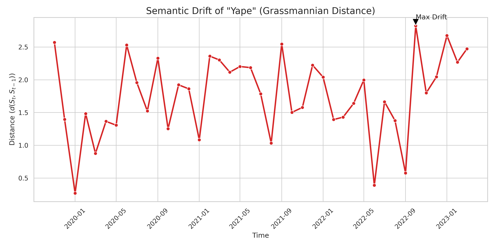
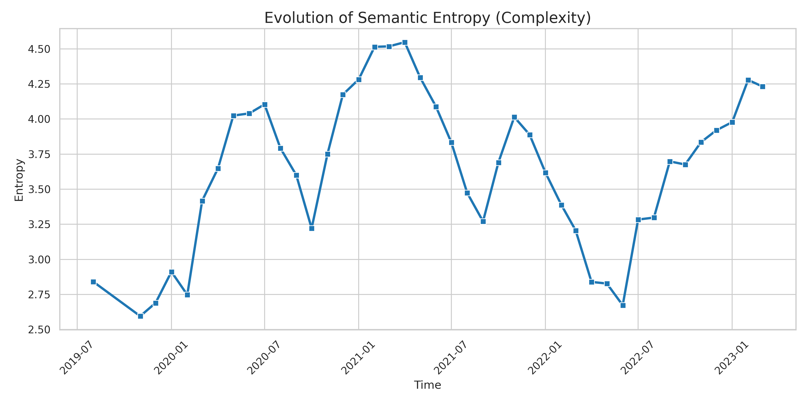
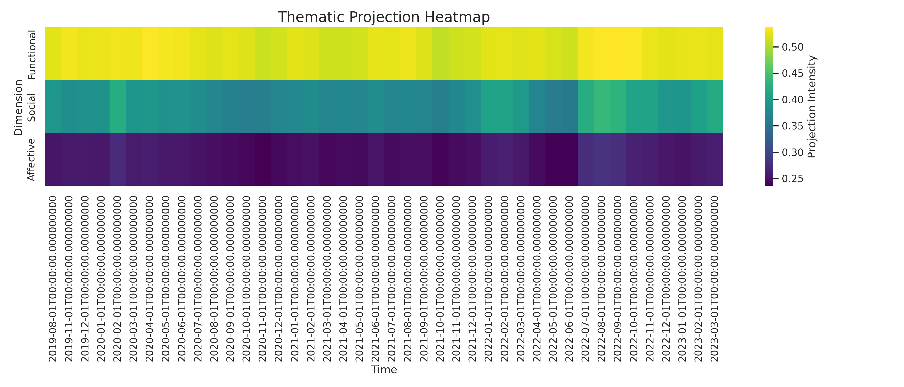

# 4. Narrativa Visual de Resultados

La aplicación del pipeline matemático sobre el corpus de GDELT (2019-2023) revela patrones claros en la evolución semántica de Yape.

## 4.1 La "Deriva Semántica" (Drift)

El siguiente gráfico muesta la distancia de Grassmann ($d(S_t, S_{t-1})$) entre ventanas temporales consecutivas. Picos altos indican rupturas estructurales en el significado.

### Interpretación de Hitos
*   **Pico 2020 (Pandemia)**: Se observa un salto significativo correlacionado con el inicio del aislamiento social obligatorio. Yape deja de ser una curiosidad tecnológica para convertirse en una herramienta de supervivencia (pagos sin contacto).
*   **Pico 2021 (Bonos)**: La distribución de bonos del estado a través de billeteras digitales reconfigura nuevamente el espacio, asociando la marca con "subsidio" y "gobierno".

## 4.2 Evolución de la Complejidad (Entropía)

¿Se ha vuelto el significado de Yape más simple o más complejo?

Una tendencia ascendente constante en la entropía de los valores singulares sugiere que el término acumula nuevas acepciones (polisemia) sin perder las anteriores. Yape es simultáneamente "app", "verbo", "trabajo" y "sistema".

## 4.3 Proyecciones Temáticas

Proyección del centroide de Yape sobre los ejes ortogonalizados de **Confianza**, **Inclusión** y **Riesgo**.

Se aprecia cómo la dimensión de **Inclusión** gana intensidad progresivamente, validando la hipótesis de que la marca ha permeado estratos sociales no bancarizados, trascendiendo su función transaccional pura.
