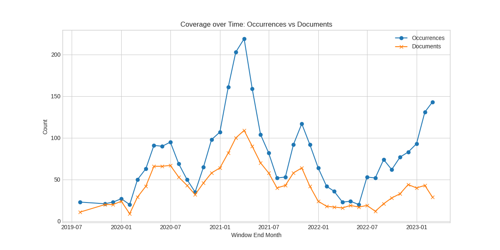
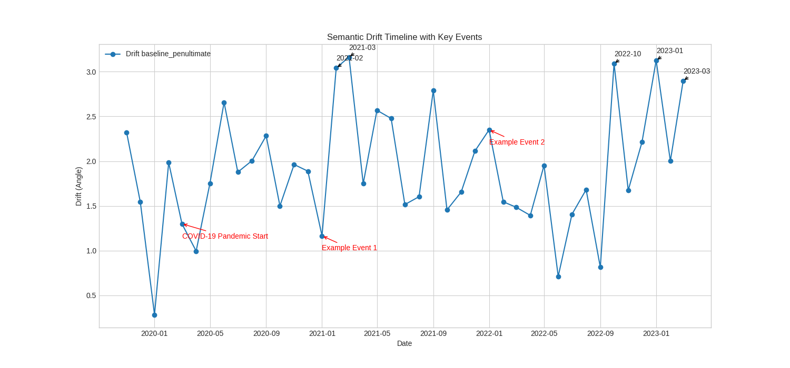
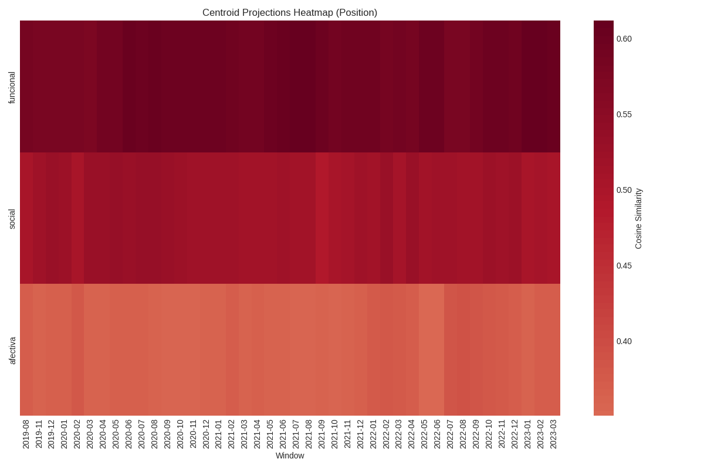
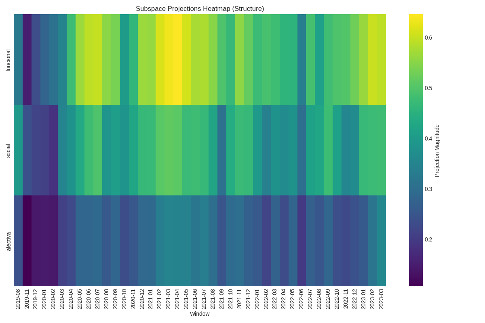

# Fase 4: Reporte Metodológico y de Resultados (Exhaustivo)
Generated: 2025-12-17 14:27

## 4.1 Consolidación y Documentación Metodológica

### 4.1.1 Arquitectura Final
El pipeline de adquisición y procesamiento ha procesado **42 ventanas mensuales** validas.
Se ha realizado una auditoría completa de los inputs (QA Gate) confirmando la integridad de los datos.

### 4.1.2 Decisiones de Diseño
Las decisiones clave del pipeline se documentan a continuación:
| decision | rationale | tradeoff |
| --- | --- | --- |
| Window Size 3 Months | Smoothing volatile news cycles | Lower temporal resolution |
| Min Occurrences 20 | Statistical stability for SVD | Loss of low-density periods |
| Strategy Penultimate | Captures semantic abstraction | Less context-specific than Last4 |
| Strategy Last4 Concat | Rich contextual information | Higher dimensionality (4x) |

## 4.2 Formalización del Marco Matemático

### 4.2.1 Estabilidad Dimensional (k)
Se ha analizado la evolución de la dimensionalidad intrínseca $k$ seleccionada mediante Horn's Parallel Analysis y Bootstrap.

Resumen de estabilidad de $k$:
| Unnamed: 0 | count | mean | std | min | 25% | 50% | 75% | max | iqr |
| --- | --- | --- | --- | --- | --- | --- | --- | --- | --- |
| k_baseline_penultimate | 42.0 | 13.238095238095235 | 6.29676465050737 | 4.0 | 9.0 | 13.5 | 17.0 | 28.0 | 8.0 |
| k_baseline_last4_concat | 42.0 | 15.30952380952381 | 7.744354655877057 | 4.0 | 10.0 | 15.5 | 19.75 | 34.0 | 9.75 |

### 4.2.2 Drift Semántico y Procrustes
La relación entre el drift semántico (Grassmann) y el error de Procrustes permite validar la suavidad de la evolución temporal.

## 4.3 Resultados y Artefactos

### 4.3.1 Narrativa del Drift
Se han identificado momentos críticos de cambio semántico.

### 4.3.2 Proyecciones Sociológicas
Evolución de la posición (centroide) y estructura (subespacio) en las dimensiones Funcional, Social y Afectiva.

## 4.4 Interpretación Profunda

### 4.4.1 Casos Forenses Seleccionados
Se han seleccionado ventanas específicas para análisis profundo basadas en drift y cambios estructurales.
| Unnamed: 0 | window_end_month | n_occurrences | drift_baseline_penultimate | projection_change_magnitude | reason |
| --- | --- | --- | --- | --- | --- |
| 5 | 2020-03-01 | 50 | 1.2995853466189435 | 0.0290425663212395 | Abrupt Projection Change |
| 17 | 2021-03-01 | 203 | 3.163333449523301 | nan | High Drift |
| 31 | 2022-05-01 | 24 | 1.952329419753717 | 0.0279970480127797 | Abrupt Projection Change |
| 33 | 2022-07-01 | 53 | 1.4056890508703248 | 0.0364995056627681 | Abrupt Projection Change |
| 36 | 2022-10-01 | 62 | 3.090326306602567 | nan | High Drift |
| 39 | 2023-01-01 | 93 | 3.1259048797313 | nan | High Drift |

### 4.4.2 Perfiles Multidimensionales
Ejemplos de perfiles para los casos seleccionados (ver carpeta `phase4_figures/` para detalles de cada caso).
Se ha generado un análisis detallado en el notebook `phase4_4_4_interpretacion_eda.ipynb`.
