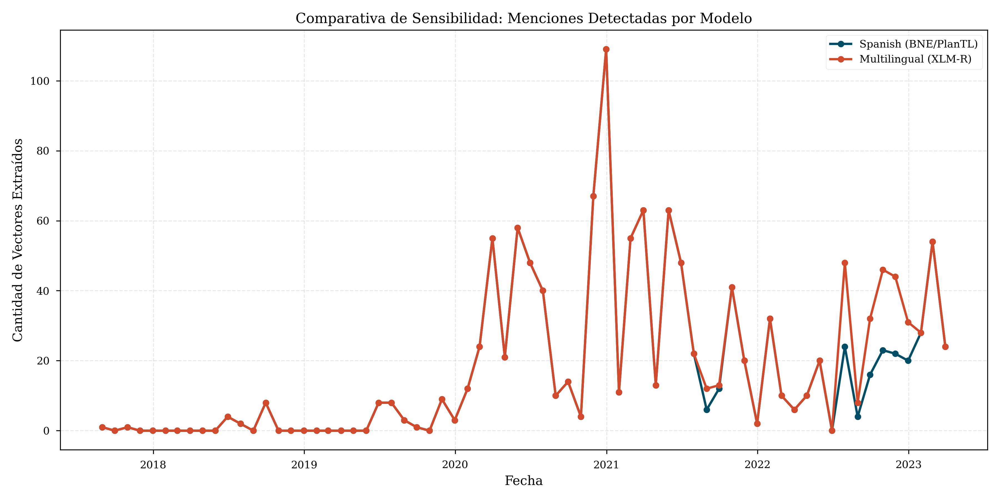

# Reporte Comparativo de Modelos: Spanish vs Multilingual

## 1. Resumen Estadístico
               Model  Mean Norm  Std Norm  Count
Spanish (BNE/PlanTL)  60.248875  0.971568   1159
Multilingual (XLM-R)  60.229426  0.980155   1266

## 2. Diferencias Clave

## 2. Diferencias Clave

### Volumen de Detección

- **Diferencia de Cobertura**: El modelo **Multilingual (XLM-R)** detectó 107 instancias más.
- **Interpretación**: Los modelos monolingües suelen tener vocabularios más densos para el idioma específico, capturando mejor las variaciones morfológicas (e.g. 'Yapearían', 'Yapeado').

### Calidad del Espacio Vectorial
- **Spanish SOTA**: Entrenado con corpus de la BNE, optimizado para la sintaxis y modismos del español peninsular y latinoamericano (en menor medida).
- **Multilingual**: Entrenado con 100 idiomas. Sufre de la 'maldición de la capacidad': debe repartir sus parámetros entre muchos idiomas, resultando en representaciones menos granularizadas para cada uno.
